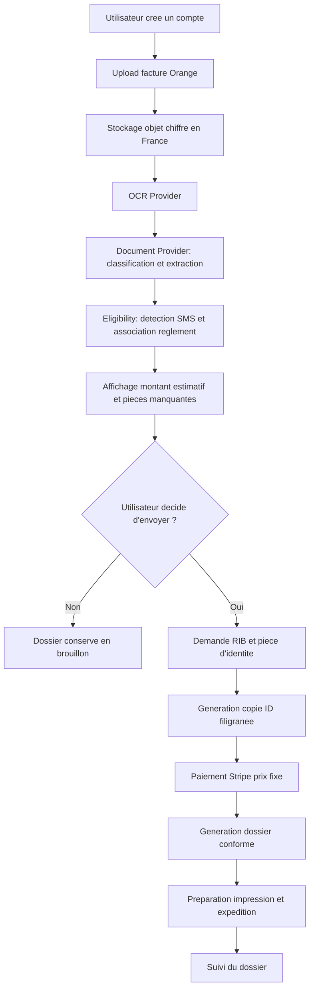
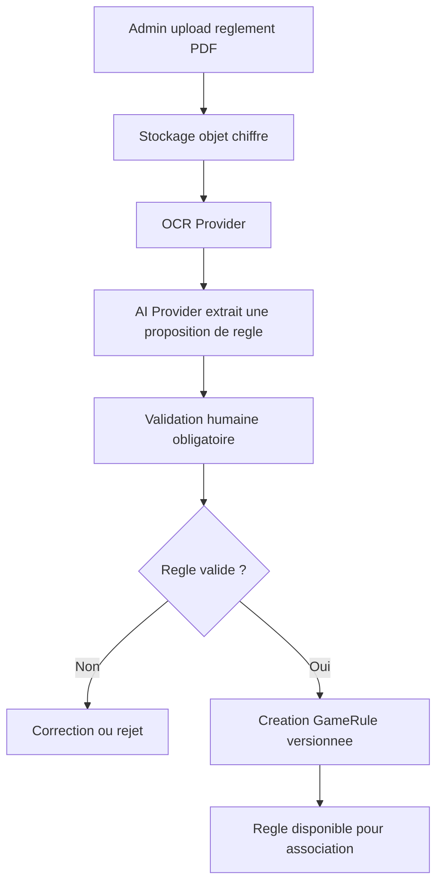

# Architecture cible Lydoc

## Decision CTO

Lydoc doit etre concu comme un moteur documentaire generique, pas comme un produit de remboursement. Le cas "jeux TV" est le premier vertical, mais le coeur doit rester capable de traiter demain des ODR, garanties, billets de train, billets d'avion ou autres demarches administratives sans reecrire l'architecture.

Le principe produit central est :

> Lydoc prepare un dossier conforme au reglement. Lydoc ne promet jamais le remboursement.

Cette formulation doit guider le code, l'interface, les emails, les statuts et les conditions de vente.

## Architecture globale

Monorepo recommande :

- `apps/web` : application Next.js publique, espace client et espace admin.
- `apps/api` : API NestJS, OpenAPI, authentification, orchestration metier.
- `packages/domain` : domaine pur TypeScript, sans dependance framework.
- `packages/application` : cas d'usage, ports, DTO applicatifs, orchestration.
- `packages/infrastructure` : Prisma, S3, Stripe, Resend, Mistral, stockage chiffre.
- `packages/ui` : composants design system partages.
- `packages/config` : configuration typee, variables d'environnement, feature flags.
- `packages/testing` : factories, fixtures, tests d'integration.
- `prisma` : schema, migrations et seed de developpement.
- `docs` : architecture, conventions, ADR, flux, securite.

Le backend suit une architecture hexagonale :

- Domain : entites, value objects, regles metier, evenements.
- Application : use cases, ports, transactions, politique d'acces.
- Infrastructure : adapters vers Prisma, Mistral, S3, Stripe, Resend.
- Interface : controllers HTTP, OpenAPI, guards, presenters.

Le frontend ne doit pas connaitre les fournisseurs techniques. Il consomme des endpoints orientes cas d'usage : creer un document, lancer une analyse, completer un dossier, payer un envoi.

## Domaines metiers

### Identity

Responsabilites :

- compte utilisateur
- session
- roles `USER`, `ADMIN`
- consentements
- journalisation des acces sensibles

Hors scope MVP :

- organisation multi-utilisateur
- SSO
- delegation de compte

### Document Intake

Responsabilites :

- upload de documents
- classification de type
- stockage chiffre
- extraction OCR
- versioning des fichiers
- statut d'analyse

Types MVP :

- reglement PDF
- facture Orange
- piece d'identite
- RIB

Types prepares :

- billet SNCF
- billet avion
- preuve d'achat ODR
- garantie
- autre document administratif

### Rule Management

Responsabilites :

- ingestion d'un reglement PDF
- extraction IA structuree
- validation admin obligatoire
- creation d'une `GameRule`
- contraintes de conformite
- pieces requises
- fenetres d'eligibilite

Le MVP ne doit pas accepter une regle IA non validee par un admin.

### Eligibility

Responsabilites :

- detection des demarches possibles depuis un document utilisateur
- association document -> reglement
- calcul du montant estimatif recuperable
- calcul du cout d'envoi
- recommandation d'attente si plusieurs demandes peuvent etre regroupees

La sortie doit rester probabiliste et transparente :

- `estimatedRecoverableAmount`
- `confidence`
- `missingRequirements`
- `complianceWarnings`

### Case Management

Responsabilites :

- creation d'un dossier administratif
- statut du dossier
- pieces manquantes
- generation du paquet documentaire
- preparation impression
- preparation expedition
- suivi

Le dossier est l'objet central cote utilisateur.

### Payment

Responsabilites :

- paiement fixe par dossier envoye
- creation session Stripe
- webhook Stripe
- preuve de paiement
- verrouillage du dossier apres paiement

Interdit dans le modele :

- abonnement
- commission
- pourcentage du remboursement

### Fulfillment

Responsabilites :

- generation PDF final
- copie filigranee de la piece d'identite
- impression
- mise sous pli
- affranchissement
- suivi expedition

Le MVP peut simuler l'impression et l'expedition via des statuts internes, mais les ports doivent deja exister.

### Admin

Responsabilites :

- validation des reglements extraits par IA
- supervision des documents analyses
- gestion des dossiers
- audit des erreurs OCR/IA
- relance manuelle si besoin

## Diagramme des flux MVP



## Flux admin de creation GameRule



## Schema Prisma propose

```prisma
generator client {
  provider = "prisma-client-js"
}

datasource db {
  provider = "postgresql"
  url      = env("DATABASE_URL")
}

enum UserRole {
  USER
  ADMIN
}

enum DocumentKind {
  GAME_RULE_PDF
  ORANGE_INVOICE
  IDENTITY_DOCUMENT
  BANK_DETAILS
  TRAIN_TICKET
  FLIGHT_TICKET
  PURCHASE_PROOF
  WARRANTY
  OTHER
}

enum DocumentStatus {
  UPLOADED
  OCR_PENDING
  OCR_DONE
  ANALYSIS_PENDING
  ANALYZED
  FAILED
}

enum RuleStatus {
  DRAFT
  AI_EXTRACTED
  NEEDS_REVIEW
  APPROVED
  REJECTED
  ARCHIVED
}

enum CaseStatus {
  DRAFT
  WAITING_FOR_USER_DOCUMENTS
  READY_TO_PAY
  PAID
  GENERATED
  PRINT_READY
  SENT
  REFUNDED
  REJECTED
  CANCELLED
}

enum PaymentStatus {
  PENDING
  PAID
  FAILED
  REFUNDED
}

model User {
  id           String   @id @default(cuid())
  email        String   @unique
  passwordHash String
  role         UserRole @default(USER)
  createdAt    DateTime @default(now())
  updatedAt    DateTime @updatedAt

  documents    Document[]
  cases        AdministrativeCase[]
  auditLogs    AuditLog[]
}

model Document {
  id             String         @id @default(cuid())
  ownerId        String?
  kind           DocumentKind
  status         DocumentStatus @default(UPLOADED)
  originalName   String
  mimeType       String
  sizeBytes      Int
  storageBucket  String
  storageKey     String
  checksumSha256 String
  encrypted      Boolean        @default(true)
  uploadedAt     DateTime       @default(now())
  analyzedAt     DateTime?

  owner          User?          @relation(fields: [ownerId], references: [id])
  ocrResult      OcrResult?
  analyses       DocumentAnalysis[]
  caseDocuments  CaseDocument[]
  gameRules      GameRule[]     @relation("RuleSourceDocument")
}

model OcrResult {
  id          String   @id @default(cuid())
  documentId  String   @unique
  provider    String
  text        String
  rawJson     Json
  confidence  Decimal? @db.Decimal(5, 4)
  createdAt   DateTime @default(now())

  document    Document @relation(fields: [documentId], references: [id])
}

model DocumentAnalysis {
  id          String   @id @default(cuid())
  documentId  String
  provider    String
  schemaName  String
  resultJson  Json
  confidence  Decimal? @db.Decimal(5, 4)
  createdAt   DateTime @default(now())

  document    Document @relation(fields: [documentId], references: [id])
}

model Organizer {
  id        String   @id @default(cuid())
  name      String
  slug      String   @unique
  createdAt DateTime @default(now())
  updatedAt DateTime @updatedAt

  gameRules GameRule[]
}

model GameRule {
  id                String     @id @default(cuid())
  organizerId       String
  sourceDocumentId  String
  status            RuleStatus @default(NEEDS_REVIEW)
  name              String
  version           Int        @default(1)
  validFrom         DateTime?
  validUntil        DateTime?
  reimbursementCents Int
  requiredDocuments Json
  constraintsJson   Json
  reviewedById      String?
  reviewedAt        DateTime?
  createdAt         DateTime   @default(now())
  updatedAt         DateTime   @updatedAt

  organizer         Organizer  @relation(fields: [organizerId], references: [id])
  sourceDocument    Document   @relation("RuleSourceDocument", fields: [sourceDocumentId], references: [id])
  cases             AdministrativeCase[]
}

model AdministrativeCase {
  id                         String     @id @default(cuid())
  ownerId                    String
  gameRuleId                 String?
  status                     CaseStatus @default(DRAFT)
  estimatedRecoverableCents   Int
  serviceFeeCents            Int        @default(299)
  confidence                 Decimal?   @db.Decimal(5, 4)
  complianceSnapshotJson      Json
  createdAt                  DateTime   @default(now())
  updatedAt                  DateTime   @updatedAt

  owner                      User       @relation(fields: [ownerId], references: [id])
  gameRule                   GameRule?  @relation(fields: [gameRuleId], references: [id])
  documents                  CaseDocument[]
  payment                    Payment?
  generatedPackets           GeneratedPacket[]
}

model CaseDocument {
  id         String   @id @default(cuid())
  caseId     String
  documentId String
  purpose    String
  createdAt  DateTime @default(now())

  case       AdministrativeCase @relation(fields: [caseId], references: [id])
  document   Document           @relation(fields: [documentId], references: [id])

  @@unique([caseId, documentId, purpose])
}

model Payment {
  id                    String        @id @default(cuid())
  caseId                String        @unique
  status                PaymentStatus @default(PENDING)
  amountCents           Int
  currency              String        @default("eur")
  stripeCheckoutSession String?
  stripePaymentIntent   String?
  paidAt                DateTime?
  createdAt             DateTime      @default(now())
  updatedAt             DateTime      @updatedAt

  case                  AdministrativeCase @relation(fields: [caseId], references: [id])
}

model GeneratedPacket {
  id            String   @id @default(cuid())
  caseId        String
  storageBucket String
  storageKey    String
  checksumSha256 String
  createdAt     DateTime @default(now())

  case          AdministrativeCase @relation(fields: [caseId], references: [id])
}

model AuditLog {
  id          String   @id @default(cuid())
  actorId     String?
  action      String
  entityType  String
  entityId    String
  metadata    Json?
  createdAt   DateTime @default(now())

  actor       User?    @relation(fields: [actorId], references: [id])
}
```

## Arborescence cible

```text
.
|-- apps
|   |-- api
|   |   |-- src
|   |   |   |-- main.ts
|   |   |   |-- app.module.ts
|   |   |   |-- modules
|   |   |   |   |-- identity
|   |   |   |   |-- documents
|   |   |   |   |-- rules
|   |   |   |   |-- eligibility
|   |   |   |   |-- cases
|   |   |   |   |-- payments
|   |   |   |   |-- fulfillment
|   |   |   |   `-- admin
|   |   |   `-- openapi
|   |   `-- test
|   `-- web
|       |-- app
|       |   |-- (public)
|       |   |-- (auth)
|       |   |-- dashboard
|       |   |-- documents
|       |   |-- cases
|       |   `-- admin
|       |-- components
|       |-- lib
|       `-- styles
|-- packages
|   |-- domain
|   |   |-- src
|   |   |   |-- identity
|   |   |   |-- documents
|   |   |   |-- rules
|   |   |   |-- eligibility
|   |   |   |-- cases
|   |   |   |-- payments
|   |   |   `-- fulfillment
|   |-- application
|   |   |-- src
|   |   |   |-- ports
|   |   |   |-- use-cases
|   |   |   `-- dto
|   |-- infrastructure
|   |   |-- src
|   |   |   |-- prisma
|   |   |   |-- storage
|   |   |   |-- ai
|   |   |   |-- ocr
|   |   |   |-- payments
|   |   |   `-- email
|   |-- ui
|   |-- config
|   `-- testing
|-- prisma
|   |-- schema.prisma
|   `-- migrations
|-- docs
|   |-- architecture-lydoc.md
|   `-- conventions.md
|-- docker-compose.yml
|-- package.json
|-- pnpm-workspace.yaml
`-- turbo.json
```

## Interfaces principales

Les interfaces suivantes appartiennent a `packages/application/src/ports`. Elles isolent le metier des fournisseurs.

```ts
export interface AiProvider {
  extractStructuredData<TSchema>(
    input: AiExtractionInput,
    schema: TSchema,
  ): Promise<AiExtractionResult<TSchema>>;
}

export interface OcrProvider {
  extractText(input: OcrInput): Promise<OcrResult>;
}

export interface DocumentProvider {
  classify(input: DocumentClassificationInput): Promise<DocumentClassificationResult>;
  extractBusinessFacts(input: BusinessFactExtractionInput): Promise<BusinessFactExtractionResult>;
}

export interface ObjectStorageProvider {
  putEncryptedObject(input: PutObjectInput): Promise<StoredObjectRef>;
  getSignedReadUrl(input: StoredObjectRef, ttlSeconds: number): Promise<string>;
  deleteObject(input: StoredObjectRef): Promise<void>;
}

export interface PaymentProvider {
  createCheckoutSession(input: CheckoutSessionInput): Promise<CheckoutSession>;
  verifyWebhook(input: PaymentWebhookInput): Promise<VerifiedPaymentEvent>;
}

export interface PdfGenerationProvider {
  generateCasePacket(input: CasePacketInput): Promise<GeneratedDocument>;
  watermarkIdentityCopy(input: WatermarkIdentityInput): Promise<GeneratedDocument>;
}

export interface MailProvider {
  sendTransactionalEmail(input: TransactionalEmailInput): Promise<void>;
}
```

## Use cases MVP

- `RegisterUser`
- `AuthenticateUser`
- `UploadGameRulePdf`
- `ExtractGameRuleCandidate`
- `ReviewGameRuleCandidate`
- `UploadUserDocument`
- `AnalyzeOrangeInvoice`
- `DetectSmsParticipation`
- `MatchInvoiceWithGameRule`
- `CreateAdministrativeCase`
- `RequestMissingCaseDocuments`
- `AttachBankDetails`
- `AttachIdentityDocument`
- `GenerateWatermarkedIdentityCopy`
- `CreateCasePaymentSession`
- `HandleStripeWebhook`
- `GenerateCompliantCasePacket`
- `MarkCaseReadyForFulfillment`
- `ListUserDashboard`
- `ListAdminReviewQueue`

## Conventions de code

- TypeScript strict obligatoire.
- Aucune dependance framework dans `packages/domain`.
- Les use cases ne retournent pas d'entites Prisma.
- Les controllers exposent des DTO publics, jamais les modeles internes.
- Les providers externes sont injectes par interface.
- Les erreurs metier sont explicites : `DocumentNotAnalyzableError`, `RuleNotApprovedError`, `CaseMissingRequiredDocumentError`.
- Tous les montants sont stockes en centimes entiers.
- Toutes les dates sont stockees en UTC.
- Les secrets ne sont jamais lus directement dans le domaine.
- Les documents sensibles sont chiffres avant stockage.
- Les acces aux documents sensibles generent un `AuditLog`.
- Les webhooks Stripe sont idempotents.
- Les extractions IA sont conservees avec provider, schema et confidence pour audit.
- Les validations admin creent une version immuable de regle.

## UX et design

La direction visuelle fournie est bonne pour le MVP : blanc, bleu-violet, cartes legeres, parcours rassurant. Je recommande toutefois de remplacer le wording "Nous trouvons l'argent que vous pouvez recuperer" par une promesse plus conforme :

> Deposez un document. Nous preparons votre dossier conforme.

Principes UX :

- Ne demander RIB et piece d'identite qu'apres estimation et decision utilisateur.
- Afficher "montant estimatif recuperable", jamais "montant garanti".
- Expliquer que le paiement couvre la preparation, l'impression, l'affranchissement et le suivi.
- Donner un statut clair au dossier : brouillon, pieces manquantes, pret a envoyer, envoye.
- Mettre en avant l'hebergement France, le chiffrement et le filigrane des copies d'identite.

## Securite et conformite

Risques principaux :

- fuite de documents sensibles
- confiance excessive dans l'IA
- promesse commerciale interpretee comme obligation de resultat
- erreurs OCR menant a un dossier non conforme
- conservation excessive de donnees personnelles
- webhook paiement non idempotent

Mesures recommandees :

- stockage objet compatible S3 en region France, chiffrement cote serveur et cle applicative si possible
- liens signes a duree courte
- antivirus sur uploads avant analyse
- validation admin obligatoire des reglements
- journal d'audit pour lecture, telechargement, suppression
- politique de retention par type de document
- suppression automatique des dossiers abandonnes apres delai configurable
- rate limiting upload et auth
- validation MIME + taille + checksum
- tests d'integration sur les statuts critiques

## Roadmap d'iterations

### Iteration 1 - Socle technique

- monorepo pnpm/turbo
- Next.js, NestJS, Prisma, PostgreSQL
- configuration typee
- CI lint, typecheck, test
- Docker Compose local

### Iteration 2 - Identity et documents

- inscription/connexion
- upload securise
- stockage local compatible S3 en dev
- modeles Prisma initiaux
- dashboard minimal

### Iteration 3 - Admin reglements

- upload reglement PDF
- OCR
- extraction IA via ports
- validation admin
- creation GameRule

### Iteration 4 - Facture Orange et eligibility

- upload facture Orange
- OCR
- detection SMS
- matching GameRule
- creation dossier brouillon

### Iteration 5 - Pieces, paiement, dossier PDF

- collecte RIB et piece d'identite apres decision
- copie filigranee
- Stripe checkout
- generation PDF final
- statuts fulfillment

## Points a valider avant implementation

- Nom produit a utiliser dans l'UI : `Lydoc`, ou garder un nom neutre en attendant.
- Fournisseur S3 francais cible pour le MVP : OVHcloud par defaut.
- Strategie auth : credentials email/mot de passe pour MVP, magic link plus tard ou maintenant.
- Retention des documents sensibles : duree cible par statut.
- Niveau de simulation fulfillment dans le MVP.
- Lib PDF cible pour generation et filigrane.

